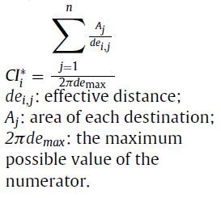

# CCI ArcMap Tools

## ArcMap Toolset to calculate **Connectivity Index (CCI)** developed by Mancebo Quintana, Santiago.

 

Translation of the original code in ARC Macro Language (AML)

File contains three python toolboxes nedeed for calculation:
1. Set Up Barriers
2. Set Up Matrices
3. Connectivity Index

**For more information see the repository TFG_GIF_2019**
